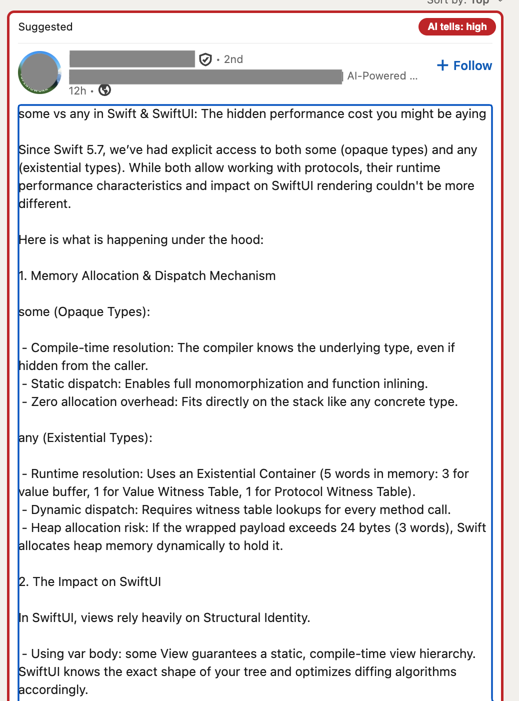
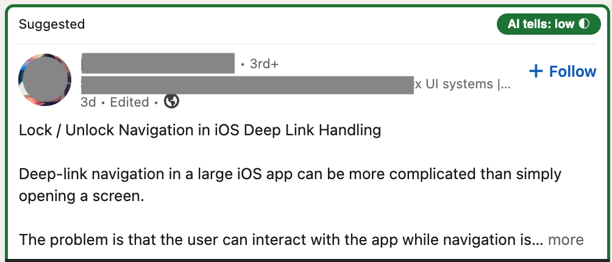
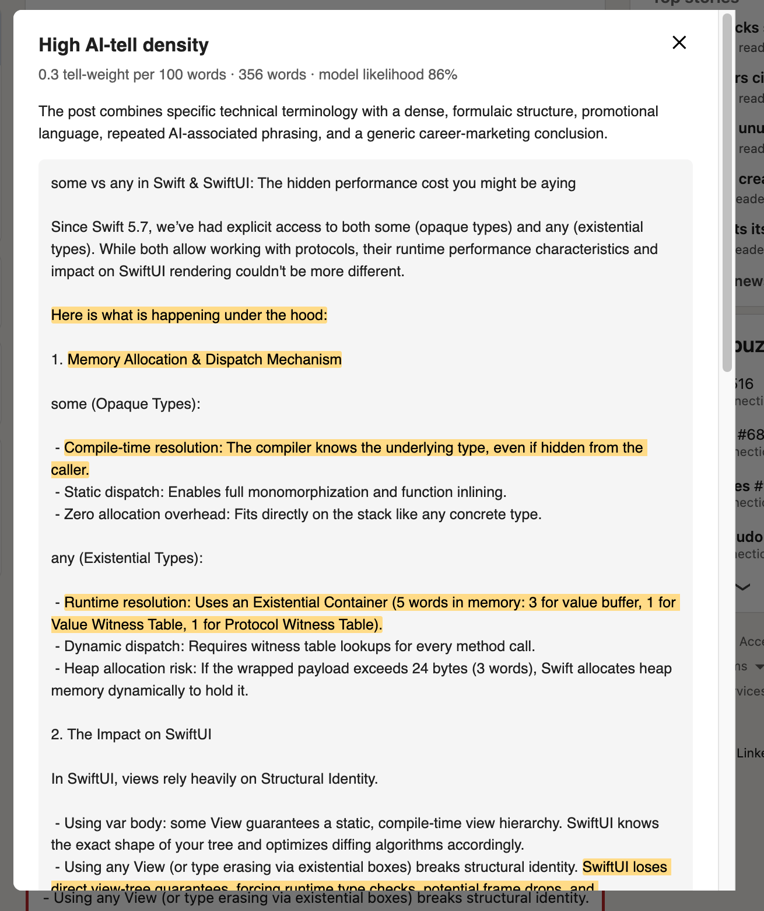
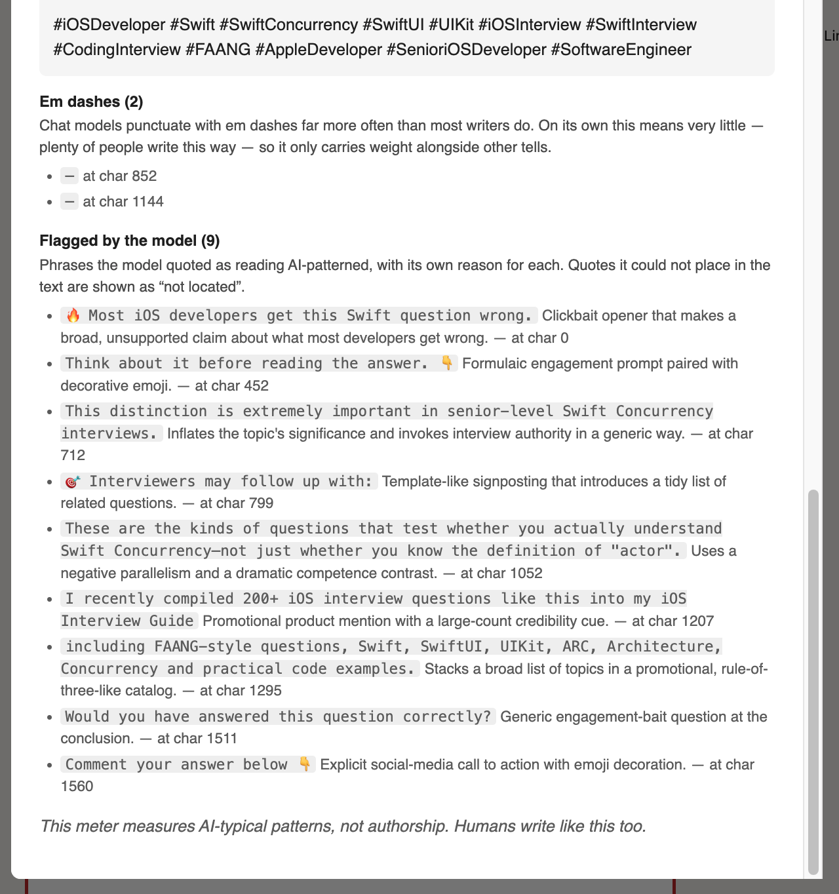

# Slop Radar

A Chrome (Manifest V3) extension that flags **AI-patterned writing** in your LinkedIn
feed. Every post, and optionally every comment, gets a coloured border and a badge:

| Border | Meaning |
| --- | --- |
| 🟩 green | little AI-typical patterning |
| 🟨 yellow | noticeable AI-typical patterning |
| 🟥 red | dense AI-typical patterning |
| (none / grey badge) | no verdict, because the text is too short or not English |

Clicking the badge opens a report. It shows the post with every detected tell
highlighted in place (em dashes, "not X, it's Y" contrast templates, stock AI
vocabulary, emoji listicles, unicode-bold headers, engagement-bait closers) plus the
model's own reasoning when model analysis is on.

> **A radar, not an authorship oracle.** Slop Radar measures how strongly text reads
> as AI-patterned. Humans write like this too, especially ghostwritten,
> engagement-optimised LinkedIn humans. Red means "reads heavily AI-patterned", never
> "this person used AI".

## What it looks like

Three verdicts on a real feed. The badge carries the tier, and `◐` means the post was
still clamped behind "…see more" when it was scored, so only the visible text counted.



**Red.** A numbered explainer built from parallel bullet blocks. The border is drawn
on the card itself and the badge sits top-right.


**Yellow.** Emoji-led header lines and a poll. Noticeable patterning, nothing dense.



**Green.** Plain prose about deep-link handling. Scored on visible text only, hence
the `◐`.

Clicking any badge opens the report, which has three parts. The header gives the
verdict, the density, the word count and the model's likelihood, followed by the
model's one-line summary:



Under that, the post text with each tell highlighted where it occurs. Then the
findings, grouped by pattern. Each group says what the pattern is and why it counts,
including where it does not count, followed by the model's own quotes and its reason
for each one:



The names in these screenshots are redacted. The posts are real.

## How the analysis works

**The model does the judging.** A fixed pattern list only catches what it enumerates,
and paraphrased or novel constructions need judgment. Verdicts come from an LLM you
configure, behind any OpenAI-compatible `/chat/completions` endpoint, which returns a
0 to 1 likelihood plus verbatim quotes of the phrases it found suspicious. Those
quotes get located back to exact offsets locally, because LLMs cannot be trusted with
character positions.

**The rubric ships from two vendored catalogs, selectable in Options and
updatable in one click.** The default source of truth is the
[gscalzo/gio-skills](https://github.com/gscalzo/gio-skills) `ai-writing-patterns`
catalog (MIT): 58 numbered tells across vocabulary, rhetoric, tone, structure,
formatting, and near-proof fingerprints, each carrying a signal tier, plus
false-positive guards and the signs of genuinely human writing. Its lineage folds
in Wikipedia's "Signs of AI writing" guide via blader/humanizer and several other
catalogs, so it is a superset of the rubric earlier versions used. It is vendored
verbatim at
[`skills/ai-writing-patterns/SKILL.md`](./skills/ai-writing-patterns/SKILL.md)
with provenance in `UPSTREAM.json`. The classic
[blader/humanizer](https://github.com/blader/humanizer) skill stays vendored
alongside it at [`skills/humanizer/SKILL.md`](./skills/humanizer/SKILL.md), and
**Rubric source** in Options switches between them — each keeps its own judging
preamble, upstream URL, and measured red boundary
([ADR 0014](./docs/adr/0014-selectable-rubric-source.md)). Both carry rewriting
guidance the judge does not need, so the per-post judge does not read them
directly. **Update
skill from GitHub** in Options runs a two-stage pipeline: download the latest
catalog, then distill it with a stronger model (default `gpt-5.6-terra`,
configurable) into a compact detection rubric holding just the tiered signals,
the false-positive rules and the clusters principle. A reviewed distilled
snapshot per source
([`skills/ai-writing-patterns/DISTILLED.md`](./skills/ai-writing-patterns/DISTILLED.md),
[`skills/humanizer/DISTILLED.md`](./skills/humanizer/DISTILLED.md))
ships in the repo for first-run and keyless installs. Precedence: your edit beats
runtime distillation, which beats the bundled snapshot. The judging preamble and
the JSON output contract are code-owned, so no update or edit can break parsing
([ADR 0008](./docs/adr/0008-upstream-skill-sync.md),
[ADR 0009](./docs/adr/0009-distilled-rubric.md),
[ADR 0013](./docs/adr/0013-rubric-source-gio-skills.md)). The deterministic detectors below
approximate the same signals in fast local regexes.

**The local pattern engine annotates and stands in.** Deterministic detectors always
run, entirely on-device, pinpointing classic tells at exact offsets for the report.
Until you configure a model they also supply the verdict, marked as an estimate with
`≈` on the badge and "pattern-only estimate" in the report.

**Honest abstention.** Posts under 40 words (comments: 20) or mostly non-Latin text
get no verdict from anyone. There is too little signal for an honest read. Posts
clamped behind "…see more" are analysed on visible text only and marked partial (◐).

**Expand-all command.** To analyse clamped items in full, press **`Alt+Shift+E`**
(remap at `chrome://extensions/shortcuts`) or click the floating **"Expand N clamped
◐"** button on the feed. The extension clicks every "…see more" toggle you could have
clicked yourself, the full text streams back through analysis, and the ◐ markers
disappear. Expansion happens **only** on your explicit command, never automatically
([ADR 0007](./docs/adr/0007-user-triggered-expansion.md)). Beyond that the extension
never clicks LinkedIn's UI and never calls LinkedIn's internal APIs. It only reads the
DOM you are already looking at.

Decisions and trade-offs are recorded in [docs/adr/](./docs/adr/). Start with
[ADR 0005](./docs/adr/0005-model-primary-analysis.md) (model-primary analysis) and
[ADR 0002](./docs/adr/0002-dom-only-extraction.md) (read-only DOM posture).

## Install

```bash
npm start                            # auto-detect a browser and install
npm start -- --browser arc           # or name one: arc|chrome|chromium|brave|edge
```

`./scripts/install.sh` builds first, then takes one of two paths, because browsers
disagree about command-line extension loading:

- **Chrome, Chromium, Brave, Edge** honour `--load-extension`, so the script launches
  a throwaway profile in `.chrome-profile/` with the extension already loaded and
  LinkedIn open. Your everyday profile, extensions and cookies are untouched, and you
  log into LinkedIn once in that window. `--clean` resets it.
- **Arc** accepts those flags and then ignores them, because it always uses its own
  profile (verified against Arc 1.158). The script copies the `dist/` path to your
  clipboard and opens Arc's extensions page instead: turn on *Developer mode*, click
  *Load unpacked*, press <kbd>⌘⇧G</kbd>, paste, *Open*. That install persists across
  restarts. After a code change run `npm run build` and hit reload on the card.

`--build` skips the browser entirely and prints the manual steps. Either way the
content script only runs on `https://www.linkedin.com/feed/`.

## Distribution

```bash
npm run package                      # → slop-radar-<version>.zip
```

A zip of `dist/` is the only packaging format worth producing, because
[off-store CRX installs are dead outside Linux](https://developer.chrome.com/docs/extensions/how-to/distribute/install-extensions).
Chrome stopped honouring local CRX files on Windows in Chrome 33 and on macOS in
Chrome 44. On those platforms an extension can only arrive three ways:

| Route | Reach | Cost |
| --- | --- | --- |
| **Chrome Web Store**, public or *unlisted* (link-only) | everyone, Arc/Brave/Edge included | one-time $5 developer registration; review from hours to days |
| **Enterprise policy** (`ExtensionInstallForcelist` + self-hosted update manifest) | machines you administer | needs MDM and a file server |
| **Load unpacked** (what `npm start` does) | you and anyone who clones the repo | free, but each user needs Developer mode on |

[Self-hosting a CRX](https://developer.chrome.com/docs/extensions/how-to/distribute/host-on-linux)
with your own update manifest still works on Linux, where users can install a packed
extension the Web Store never signed.

For something like this, **unlisted on the Web Store** is the pragmatic middle: no
public listing, a stable link, automatic updates. One thing to plan for before you
submit is that review will focus on the remote-code and privacy story, so the listing
has to disclose that post text is sent to a user-configured endpoint.

## Configure the model

Extension → *Options*:

- **API base URL.** For example `https://api.openai.com/v1`, an OpenRouter URL, or a
  local proxy. Chrome asks to grant access to that origin, and only that origin, on
  save.
- **Model.** Default **`gpt-5.6-luna`**, OpenAI's fast and affordable tier built for
  high-volume classification. Alternatives (API prices per 1M tokens, August 2026):

  | Model | Price (in / out) | Measured AUC | When |
  | --- | --- | --- | --- |
  | `gpt-5.6-luna` | $1.00 / $6.00 | **0.870** | default; nothing tested beat it |
  | `gpt-5.6-terra` | $2.50 / $15.00 | 0.857 | 2.5x the cost, no better ([ADR 0012](./docs/adr/0012-calibration-from-measurement.md)) |
  | `gpt-5.4-nano` | $0.20 / $1.25 | untested | ultra-budget, high-volume |

- **API key.** Stored in extension storage on this machine only.

**Privacy:** with model analysis enabled and a key set, feed text is sent to the
endpoint you configured. Remove the key, or untick model analysis, and everything
stays on-device as pattern-only estimates. Nothing is ever sent anywhere else.

Cost stays bounded. Only items that enter the viewport are analysed, and verdicts are
cached per post and comment.

## What the evaluation found

The default model and the tier boundaries started as guesses. They have now been
measured — and re-measured after the rubric moved to the ai-writing-patterns
catalog. Full reasoning is in
[ADR 0012](./docs/adr/0012-calibration-from-measurement.md) and
[ADR 0013](./docs/adr/0013-rubric-source-gio-skills.md); the short version:

**Method.** 104 posts scored through the real production path, meaning the same
rubric, the same prompt and the same parser. 60 of them human, timestamped by third
parties between 2013 and 2019, three years before ChatGPT existed. 44 AI, written by a
model from a different family than the models being judged, so nothing grades its own
output. The headline metric is **AUC**: the probability that a random AI post outranks
a random human one, where 1.0 is perfect and 0.5 is a coin flip. AUC rather than
accuracy, because accuracy depends on where the tiers sit and the tiers were exactly
what was in question.

All four model × rubric combinations, measured in fresh runs on the same
corpus (obvious = emoji lists, staccato, stock openers; hard = AI written with
concrete specifics and no surface tells):

| Model × rubric | AUC | obvious | hard | top human | Cost (in / out) |
| --- | --- | --- | --- | --- | --- |
| `luna` × humanizer | 0.863 | 0.945 | 0.732 | 0.58 | $1.00 / $6.00 |
| `luna` × ai-writing-patterns | 0.844 | 0.932 | 0.704 | 0.64 | $1.00 / $6.00 |
| `terra` × humanizer | 0.883 | 0.973 | 0.741 | 0.22 | $2.50 / $15.00 |
| `terra` × ai-writing-patterns | **0.901** | **0.982** | **0.772** | 0.22 | $2.50 / $15.00 |

Read this with the noise floor in mind: re-running an *identical*
configuration moved terra × humanizer from 0.857 to 0.883, so differences
under ~0.03 on this corpus are weather, not climate. What survives that bar:

- **The model matters more than the rubric.** Terra outranks luna under both
  rubrics, and it keeps every human sample at or below 0.22 — far from any
  boundary — under both. If you will pay 2.5× per post, terra is one Options
  field away regardless of rubric choice.
- **The rubrics tie on AUC, with consistent leanings.** The tiered catalog is
  directionally best with terra on every split; the humanizer catalogue is
  directionally better with luna. Every individual gap is within noise.
- **At the shipped boundaries, the catalog is gentler on humans with luna.**
  The humanizer rubric runs luna hotter (mean(ai) 0.41 vs 0.36) and puts
  three human samples in yellow (0.58, 0.43, 0.38); the catalog puts exactly
  one (0.64). The trade: the hotter scores also catch a few more AI posts at
  yellow. Given the never-accuse posture, the default stays
  luna × ai-writing-patterns.

The judge is very good at formulaic writing and nearly useless on careful AI,
which averages 0.11–0.14 against 0.10–0.12 for real humans, under every
combination. **That is the intended behaviour rather than a defect.** A post
with no AI-typical patterning *should* read green. The corpus only labels those posts "ai" because a machine happened to
write them, which is a property of the labels. Slop Radar measures patterning, and
there is now evidence behind the claim instead of assertion.

**Where the boundaries landed.** Each rubric source keeps the red boundary its
own evaluation produced, by the same rule: no human sample gets a red border.
The highest-scoring human — the same formulaic answer under both rubrics —
reaches 0.64 under ai-writing-patterns (red: 0.7) and 0.58 under humanizer
(red: 0.6). Yellow is 0.35 for both: the next-highest human sits well below
it, and trading more flagged humans for fewer misses is not neutral when the
whole posture is never to accuse.

The single human the judge scored above 0.35 is a 2013 Stack Exchange answer that
opens "This is a really good question" and continues in imperative bullets. It reads
formulaic because it is formulaic, written seven years before ChatGPT. The badge says
"AI tells: medium", never "this person used AI".

## Running the evaluation yourself

`npm run eval` re-runs all of the above.

```bash
cp .env.example .env      # put SLOP_RADAR_API_KEY in it; .env is gitignored
npm run eval              # 104 posts × 2 models
npm run eval -- gpt-5.6-luna,gpt-5.6-terra,gpt-5.4-nano
SLOP_RADAR_RUBRIC=humanizer npm run eval   # measure the other rubric source
```

The corpus lives in `eval/corpus`: 104 posts, 60 human and 44 AI, with
`manifest.json` recording every sample's source, author, timestamp and licence.
`node scripts/fetch-corpus.mjs --human 40` adds more human samples. `eval/local/` is
gitignored if you want to keep additions private.

**Human samples are fetched, never written.** Anyone hand-writing a "human" example is
imitating the thing being measured, and an LLM asked to do it is imitating its own
output. So they come from text a third party timestamped **before 2020**, three years
before ChatGPT, pulled from
[workplace.stackexchange.com](https://workplace.stackexchange.com) answers (the
closest public register to a LinkedIn post, CC BY-SA) and Hacker News comments, spread
across quarterly windows from 2013 to 2019, capped at two per author.

**AI samples come from a different model family than the judges.** They were written
by Claude rather than by `gpt-5.6-*`, so no judge grades output from its own family.
They span obvious slop (emoji listicles, staccato, stock openers) and deliberately
hard cases, meaning AI writing with concrete specifics and no surface tells. A corpus
of only obvious cases would measure nothing useful, since the local regex detectors
already catch those without a model. `--ai N` generates more via the API; set
`SLOP_RADAR_GEN_MODEL` to something you are not evaluating.

The report leads with **AUC**, the probability that a random AI post outranks a random
human one. It is the number to choose a model on, because it does not depend on where
the tiers sit: a model that ranks perfectly but scores inside a narrow band looks bad
on accuracy and is in fact ideal, since you can move the boundary. A threshold sweep
then shows what each candidate boundary would cost in humans-flagged against
AI-missed, and the worst cases are listed by name so you can read the posts the judge
got most wrong.

## When something looks wrong

**No verdicts on any post.** Options → **Test connection** sends one sample post and
reports the reply, or the exact error, granting the host permission if it is missing.
That permission is the usual culprit. It is optional, and only requested when you
press *Save*.

**No badges at all.** The page console always prints why. If it says
`no items — selectors: …`, LinkedIn changed its markup: the census names the anchor
that stopped matching, and `scripts/dump-feed.js` (paste into the console) captures
the whole feed as an outline to rewrite `adapters/linkedin.ts` against. See
[ADR 0011](./docs/adr/0011-sdui-anchors-and-drift.md).

**Console noise.** Only problems are printed by default. For the full trace of every
scan, judge request and verdict, set `localStorage.slopRadarDebug = "on"` in the page
console. Everything is prefixed `[slop-radar]`, so the console filter isolates it. The
service worker logs to its own console at `chrome://extensions` → Slop Radar →
**service worker**, where the model, base URL and each failure are recorded. Never the
key.

**`Extension context invalidated`.** Reloading the extension orphans the content
script in tabs that are already open. Refresh the tab; the orphan stops itself and
says so.

## Quality gates

`npm run check` is the gate: ESLint with cyclomatic complexity capped at 5, strict
TypeScript (`noUncheckedIndexedAccess`), and Vitest with 80% coverage thresholds. It
runs in CI on every push and PR (`.github/workflows/ci.yml`, which also builds the
bundle), and by hand.

The model judge sits behind an interface and is faked in tests, so CI needs no API key.

## Project layout

```
skills/         both rubric catalogs, vendored with UPSTREAM.json provenance:
                ai-writing-patterns (gscalzo/gio-skills, MIT; the default)
                and humanizer (blader/humanizer, MIT), selectable in Options
src/core        detectors, density scoring, quote location; pure, fully tested
src/judge       OpenAI-compatible judge client (the primary engine)
src/adapters    SiteAdapter interface + the LinkedIn adapter: the ONLY file that
                knows LinkedIn's DOM (posts, comments, and the census that
                reports when its anchors stop matching)
src/content     border/badge decoration, report modal, orchestrator glue
src/background  service worker: owns the API key, caches verdicts
src/options     options page
scripts         install.sh (build + load into a browser), package.sh (store zip),
                dump-feed.js / probe-*.js (console probes for markup drift)
```

Supporting another site with text blocks means one new `SiteAdapter` and a manifest
`matches` entry. Nothing in core changes.

Development is TDD: write the failing test first.
